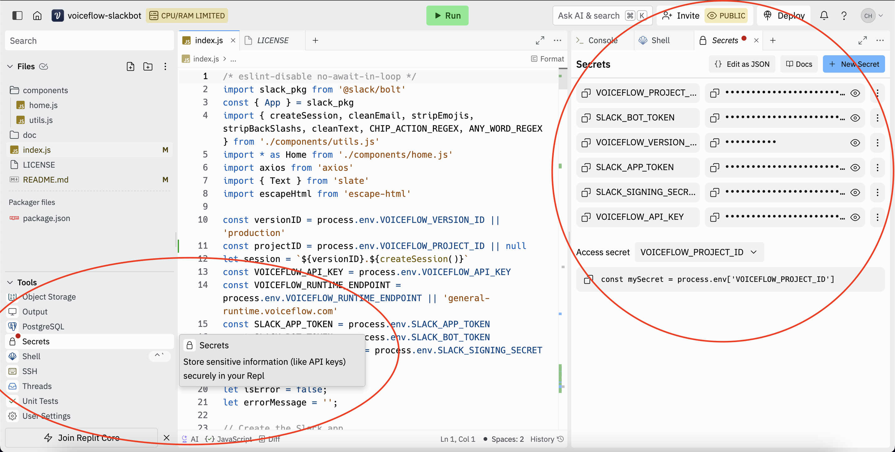
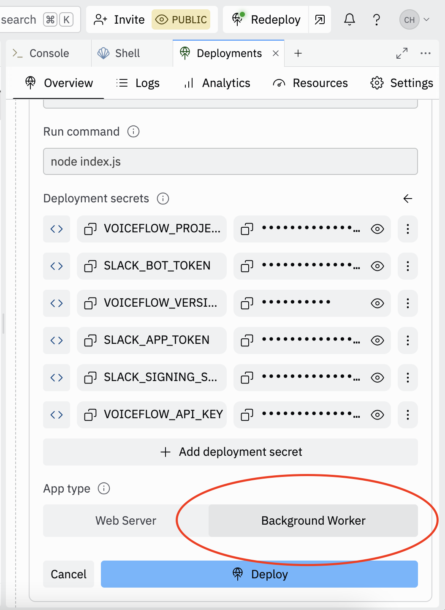

# voiceflow-slack


Connect any Voiceflow agent to a Slack Bot via the dialog API


## Setup

### Create your Slack App

1. [Create an app](https://api.slack.com/apps?new_app=1)
2. Select `From a manifest`
3. Select the workspace you want to use your app in
4. Replace the JSON with:

```json
{
    "display_information": {
        "name": "Voiceflow Slack Demo",
        "description": "Slack Bot using Voiceflow's Dialog Manager API",
        "background_color": "#37393d"
    },
    "features": {
        "app_home": {
            "home_tab_enabled": true,
            "messages_tab_enabled": true,
            "messages_tab_read_only_enabled": false
        },
        "bot_user": {
            "display_name": "Voiceflow Demo",
            "always_online": true
        }
    },
    "oauth_config": {
        "scopes": {
            "user": [
                "users:read"
            ],
            "bot": [
                "app_mentions:read",
                "channels:history",
                "chat:write",
                "im:history",
                "im:read",
                "im:write",
                "mpim:history",
                "mpim:read",
                "mpim:write",
                "users.profile:read",
                "users:read"
            ]
        }
    },
    "settings": {
        "event_subscriptions": {
            "user_events": [
                "message.app_home",
                "user_change"
            ],
            "bot_events": [
                "app_home_opened",
                "app_mention",
                "message.channels",
                "message.im",
                "message.mpim",
                "user_change"
            ]
        },
        "interactivity": {
            "is_enabled": true
        },
        "org_deploy_enabled": false,
        "socket_mode_enabled": true,
        "token_rotation_enabled": false
    }
}
```

5. Click `Next` then `Create`
6. Navigate to the `Install App` tab on the left
7. Click `Install`
8. Click `Allow`

### Obtain Slack Keys and Tokens

#### Slack Signing Secret

1. Navigate to the `Basic Information` tab on the left
2. Copy the `Signing Secret` and save it somewhere for later

#### Slack App Token

1. Scroll down and click `Generate Token and Scopes`
2. Name the token `Voiceflow Token`
3. Click `Add Scope` and select `connections:write`
4. Click Generate
5. Copy the app token and save it somewhere for later

#### Slack Bot Token

1. Navigate to the `OAuth & Permissions tab` on the left
2. Copy the `Bot User OAuth Token` and save it somewhere for later

### Obtain Voiceflow Keys and Tokens

- [Open a Voiceflow Agent](https://creator.voiceflow.com/workspace/)
- Make sure it works and that you've Published it (Green publish button in the top right)

> [!Tip]  
> Slack's formatting works different for apps then then users, consider adding [this](doc/prompts/prompt.md) to your agent's prompt

> [!NOTE]  
> Ensure that your Agent has an end function. (Logic > End). Anytime you edit your agent you will need to publish it, and start a new chat for the changes to take effect.

- Open `Settings` by pressing `7` or clicking the cogwheel on the left

#### Voiceflow API Key

1. Navigate to the `API Keys` tab on the left
2. Copy your `Primary key` and save it somewhere for later

#### Project and Version ID

1. Navigate to the `General` tab on the left
2. Copy the `Project Key` and save it somewhere for later
3. Copy the `Version ID` and save it somewhere for later

### Create your Replit app

1. Click `Run on Replit` below

[](https://replit.com/new/github/Maclean-D/voiceflow-slack)

2. Click `Import from  GitHub`
3. A `Configure Repl` window should have opened, scroll down and click `Confirm and Close`
4. Press the Search button on the top right of the screen
5. Search for `Secrets` and click the first option
6. Click `Edit as JSON` in the bottom left of the secrets tab and replace the content in it with:

```json
{
  "VOICEFLOW_API_KEY":"VF.12345678",
  "VOICEFLOW_VERSION_ID":"12345678",
  "VOICEFLOW_PROJECT_ID":"12345678",
  "VOICEFLOW_RUNTIME_ENDPOINT":"general-runtime.voiceflow.com",
  "SLACK_APP_TOKEN":"XXXX",
  "SLACK_BOT_TOKEN":"XXXXX",
  "SLACK_SIGNING_SECRET":"XXXXXXX"
}
```

> [!IMPORTANT]  
> Switch out all of the placeholders with the keys and tokens you saved for later

7. Press `Save`
8. Click `Deploy` in the top right
9. Make sure `Reserved VM` is selected
10. Click `Set up your deployment`
11. Under App Type select `Background Worker`
12. Press the `Deploy` button at the bottom

### Setup the Replit secrets

> Set new Secrets with the following info

**SLACK\_APP\_TOKEN**
Slack **app secret** (starting with **xapp-**)

**SLACK\_BOT\_TOKEN**
Slack **bot token** (starting with **xoxb-**)

**SLACK\_SIGNING\_SECRET**
Slack app **signing secret**

**VOICEFLOW\_VERSION\_ID**
Voiceflow **project version ID** (Needed if you want to save transcripts, will default to 'production' otherwise)

**VOICEFLOW\_PROJECT\_ID**
Voiceflow **project ID** (Needed if you want to save transcripts, will default to null otherwise)

**VOICEFLOW\_API\_KEY**
Voiceflow **project API key** (from the Integration section)

In the Secrets tab, you can click on Edit as JSON button and paste the following JSON (do not forget to update the keys values):
```
{
  "VOICEFLOW_API_KEY":"VF.12345678",
  "VOICEFLOW_VERSION_ID":"12345678",
  "VOICEFLOW_PROJECT_ID":"12345678",
  "VOICEFLOW_RUNTIME_ENDPOINT":"general-runtime.voiceflow.com",
  "SLACK_APP_TOKEN":"XXXX",
  "SLACK_BOT_TOKEN":"XXXXX",
  "SLACK_SIGNING_SECRET":"XXXXXXX"
}
```


### Set your App type

> Set the App type to Background Worker



### Install your Slack App

> On your **Slack workspace**, click on **Apps** > **Add apps**


> **Search** for 'Voiceflow Slack Demo' or the app name you've created earlier on Slack API website and **click on it** in the Search results list to install it


> The app is now available and you can click on **Messages** to start interacting with your bot.


[](https://sonarcloud.io/summary/new_code?id=voiceflow-community_voiceflow-slack)


## Star History

[](https://star-history.com/#Maclean-D/voiceflow-slack&Date)

## Contributors

<a href="https://github.com/Maclean-D/voiceflow-slack/graphs/contributors">
  
</a>
